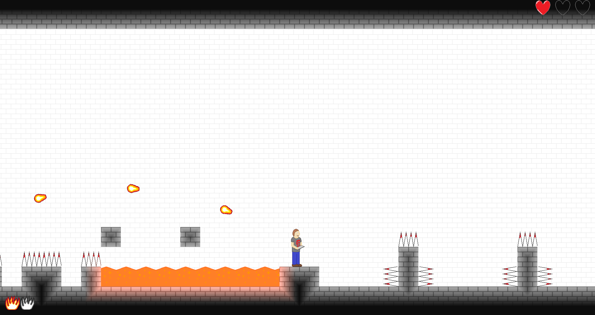

# [Python3][Pygame] Endless-Rooms - Platformer 2D

## Description technique

Ce jeu a été développé en 2015, lors de mon année de terminale, en utilisant Python 3.2.5 et Pygame.
Vous l'aurez compris à la lecture de la version, ce projet n'est plus du tout mis à jour depuis plusieurs années, mais il est cependant toujours jouable... dépendant de la machine et de l'OS. En tout cas sur ma machine (Ryzen 7 2700X, 1920x1080, Windows 10) le jeu tourne parfaitement.

Si vous voulez le tester vous trouverez un lien de téléchargement vers l'executable compilé en bas de ce README. Si vous voulez le compiler vous-même... et bien bonne chance ! Je peux tout de même vous donner la version des bibliothèques que j'utilisais:
- Python 3.2.5
- Pygame 1.9.2
- Cx_Freeze 4.3.1.

Et pour finir (vos yeux) une petite image du jeu:

Téléchargement de l'executable: [Mediafire](http://www.mediafire.com/file/3i1hr34mbawg9kq/Endless-rooms.rar/file)
